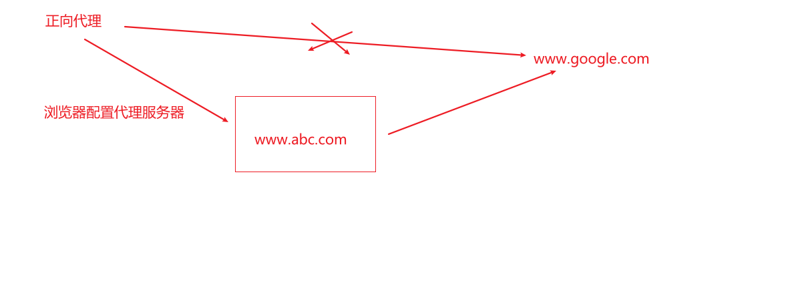
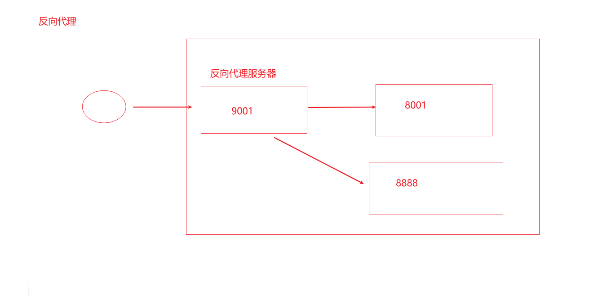
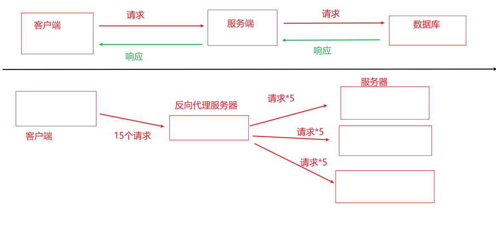
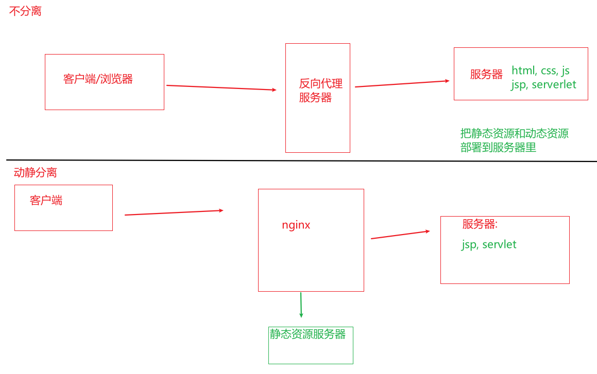

# nginx 简介

## 一. 什么是nginx

+ Nginx 是一个高性能的HTTP和反向代理服务器, 特点是占用内存少, 并发能力强, 事实上nginx的并发能力确实在同类型的网页服务器中表现更好.
+ Nginx 转为性能优化而开发, 性能是其中最重要的考量, 实现上非常注重效率, 能经受高负载的考验, 有报告表明能支持高达 50,000 个并发连接数.

## 二. 反向代理

1. 正向代理 (客户端代理)

   - 在客户端 (浏览器) 配置代理服务器, 通过代理服务器进行互联网访问

   - 

2. 反向代理 (服务端代理)

   - 将请求发送到反向代理服务器, 由反向代理服务器去选择目标服务器获取数据后, 返回给客户端, 此时反向代理服务器和目标服务器对外就是一个服务器, 暴露的是代理服务器地址, 隐藏了真实服务器IP地址
   - 

   

## 三. 负载均衡

- 单个服务器解决不了, 我们增加服务器的数量, 然后将请求分发到各个服务器上, 将负载分发到不同的服务器就是负载均衡

- 

  

  

## 四. 动静分离

- 为了加快网站的解析速度, 可以把动态页面和静态页面由不同的服务器来解析, 加快解析速度, 降低原来单个服务器压力
- 

