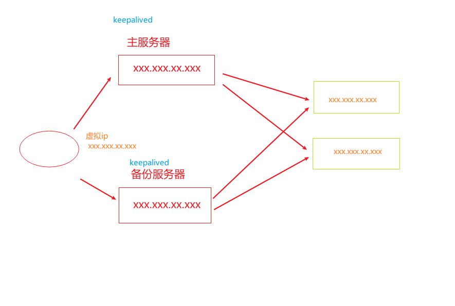

## 反向代理 

### (一) 打开浏览器, 在浏览器地址栏输入地址 跳转百度主页面

1. 具体实现

   - 对外开放端口

     firewall-cmd --add-port=8080/tcp --permanent

     firewall-cmd -reload/

   - 查看已经开放的端口

     firewall-cmd --list-all

   - 添加代理

     ```nginx
     http {
       server{
         location / {
      	  proxy_pass https://www.baidu.com/;
         }
       }
     }
     ```

### (二) 使用nginx 反向代理, 根据访问的路径跳转到不同端口的服务中

1. 具体实现

   ```nginx
   http {
     server{
       location / {
    	  proxy_pass https://www.baidu.com/;
       }
       location /a {
    	  proxy_pass https://www.baidu.com/;
       }
       location ~ /b/ {
    	  proxy_pass https://www.baidu.com/;
       }
     }
   }
   ```

+ ' = ' 用于不含正则表达式的 uri 前, 要求请求字符串与 uri 严格匹配, 如果匹配成功, 就停止继续向下搜索并处理该请求
+ '  ~  ' 用于表示 uri 包含正则表达式, 并且**区分大小写**
+ '  ~* ' 用于表示 uri 包含正则表达式, 并且**不区分大小写**
+ ' ^~ ' 用于不含正则表达式的 uri 前, 要求Nginx 服务器找到标识 uri 和请求字符串匹配度最高的 location 后, 立即使用此 location 处理请求, 而不再使用 location 块中的正则 uri 和请求字符串做匹配 
  + 注意: 如果uri包含正则表达式, 则必须要有 ~ 或者 ~* 表示


## 负载均衡

### (一) 浏览器输入地址, 负载均衡效果, 平均进入其他地址

```nginx
http {
    upstream myserver {
        ip_hash;
        server localhost:8080 weight=1;
        server localhost:8081 weight=1;
    }
    server {
        loaction / {
            proxy_pass http://myserver;
            proxy_connect_timeout: 10;
        }
    }8
}
```

+ 常用分配策略

1. 轮询 (默认)
   - 每个请求按时间顺序逐一分配到不同的后端服务器, 如果后端服务器down掉, 可以自动剔除
2. weight 
   - weight 代表权重, 默认为1, 权重越高被分配的客户端越多
   - 指定轮询几率, weight和访问比率成正比, 用于后端服务器性能不均的情况
   - **server localhost:8081 weight=1;**
3. ip_hash
   - 每个请求按访问 ip 的hash结果分配, 这样每个访客固定一个后端服务器, 可以解决session的问题
   - **ip_hash;**
4. fair (第三方)
   - 按后端服务器的响应时间来分配请求, 响应时间短的优先分配
   - **fair;**

## 动静分离

### (一) 纯粹把静态文件独立成单独的域名， 放在独立的服务器上， 也是目前主流推崇的方案

```nginx
文件路径: 
	/data
		- image/a.jpg
		- www/index.html
具体配置: 
http {
    server {
        location /www/ {
            #root 是指定项目的根目录
            root /data/; #/data/www/
            index index.html index.htm; #在前后端分离的基础上，通过Nginx配置，指定网站初始页
        }
        location /image/ {
            root /data/; #/data/image/
            autoindex on; #表示自动创建索引列表, 在页面中创建资源列表
        }
    }
}
```

### (二) 动态跟静态文件混合放在一起发布，通过nginx分开


### (三) 拓展

通过 location 指定不同的后缀名实现不同的请求和转发, 通过 **expires** 参数设置, 可以使浏览器缓存过期时间, 减少与服务器之间的请求和流量. 具体 Expire 定义: 是给一个资源设定一个过期时间, 也就是说无需去服务端验证, 直接通过浏览器自身确认是否过期即可, 所以不会产生额外的流量, 此种方式非常适合不经常变动的资源(如果经常更新的文件, 不建议使用 expires 来缓存), 我这里设置 3d, 表示在这3天之内访问这个 url, 发送一个请求, 比对服务器该文件最后更新时间没有变化, 则不会从服务器抓取, 返回状态码 304, 如果有修改, 则直接从服务器重新下载, 返回状态码 200

- 该属性添加在 location 中


## 高可用的集群



+ 安装keepalived

  + yum install keepalived -y

+ 修改keepalived.conf

  ```
  
  ```

  


